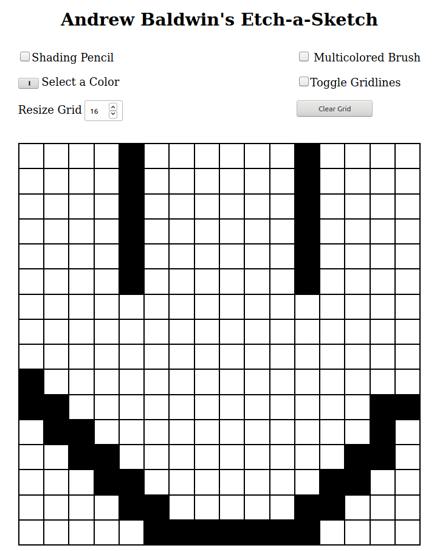
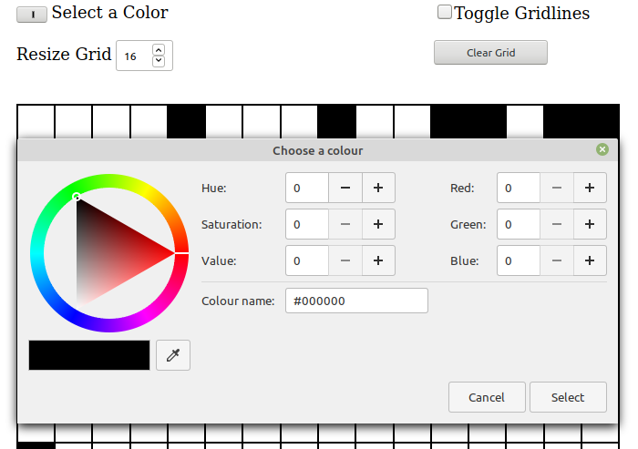
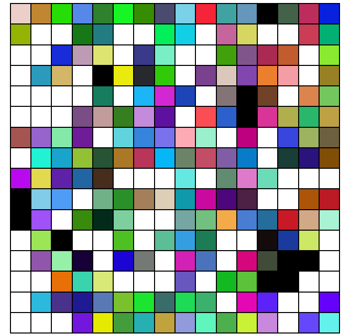
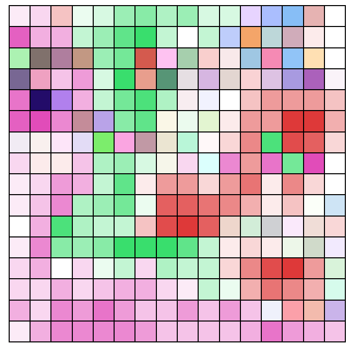

# JavaScript Etch-a-Sketch

> JavaScript Project Written for The Odin Project

<div align='center'>
  
</div><br>

## Demo

[View the Live Demo](https://andrewbaldwin44.github.io/JavaScript_Etch-a-Sketch/)

## Features

_Bring Out the Artist in You with the JavaScript Eatch-a-Sketch!_

**_Pick and Draw with all Your Favourite Colours!_**

<div align='center'>
  
</div><br>

**_Draw abstract with the Multi-Coloured Brush_**

<div align='center'>
  
</div><br>

**_Draw Details and Find that Perfect Colour with the Shading Brush_**

<div align='center'>
  
</div><br>

_The grid can also be configured to any size you'd like and the grid lines can be toggled off!_

## Deploy the project

__Clone the repo to your local machine using the terminal__:
```
$ git clone git@github.com:andrewbaldwin44/JavaScript_Etch-a-Sketch.git
```

*Then Open the `index.html` Project File in Your Browser*

### Technologies Used:

- JavaScript
- HTML
- CSS

## Author

👤 **Andrew Baldwin**

- Github: [@andrewbaldwin44](https://github.com/andrewbaldwin44)
